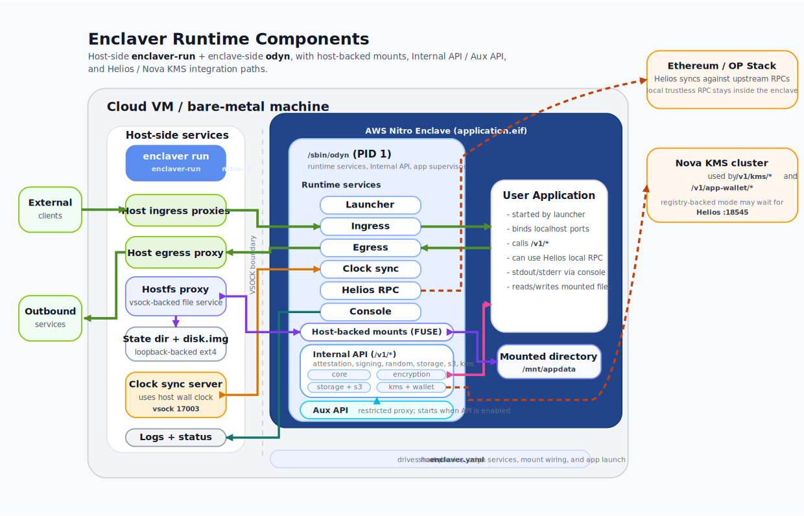

Enclaver is an open source toolkit created to enable easy adoption of software enclaves, for new and existing backend software.

This is a Sparsity edition of Enclaver. See [here](https://github.com/enclaver-io/enclaver) for original project details.

## Installation

Run this command to install the latest version of the `enclaver` CLI tool:

```bash
/bin/bash -c "$(curl -fsSL https://raw.githubusercontent.com/sparsity-xyz/enclaver/refs/heads/sparsity/install.sh)"
```

## Architecture

Read the [architecture doc](https://enclaver.io/docs/0.x/architecture/) for the full details. Enclaver consists of 3 interrelated pieces of software: 

 - `enclaver` CLI for build and run
 - “Outer Proxy” + Enclave Supervisor
 - “Inner Proxy” + Process Supervisor




## Container and EIF layout (ASCII diagram)

The diagram below shows how the release Docker image runs as a single container, what layers it contains, and how the EIF (enclave) is structured inside with odyn and its modules.

```
+----------------------------------------------------------------------------------+
| Docker Image (release) - runs as a single container                              |
|                                                                                  |
|  entrypoint: /usr/local/bin/enclaver-run                                         |
|  includes:                                                                       |
|    - /bin/nitro-cli                                                              |
|    - /enclave/enclaver.yaml   (unified config)                                   |
|    - /enclave/application.eif                                                    |
|                                                                                  |
|  Image layers (top -> bottom):                                                   |
|    [L3] /enclave/application.eif                                                 |
|    [L2] /enclave/enclaver.yaml                                                   |
|    [L1] Sleeve / wrapper base image (contains enclaver-run, nitro-cli, runtime)  |
|                                                                                  |
|  Runtime control flow:                                                           |
|    enclaver-run --> nitro-cli run-enclave --eif /enclave/application.eif         |
|                   \-> passes config from /enclave/enclaver.yaml to enclave       |
+----------------------------------------------------------------------------------+

                     | launches enclave with EIF
                     v
+-------------------------------- Enclave (application.eif) -----------------------+
| /sbin/odyn (supervisor)                                                          |
|   - launcher: start/monitor App                                                  |
|   - ingress:  inbound traffic --> App                                            |
|   - egress:   App --> outbound traffic                                           |
|   - kms-proxy: talk to external KMS over network                                 |
|   - console:  collect App stdout/stderr --> container logs                       |
|   - api/config: read unified config (from enclaver.yaml)                         |
|                                                                                  |
|   Processes:                                                                     |
|     [App process started by launcher]                                            |
+----------------------------------------------------------------------------------+

Data paths overview:

  External clients --> Container networking --> odyn.ingress --> App
  App --> odyn.egress --> Container networking --> External services
  odyn.kms-proxy <--> External KMS (network)
  App stdout/stderr --> odyn.console --> Docker container logs
```
