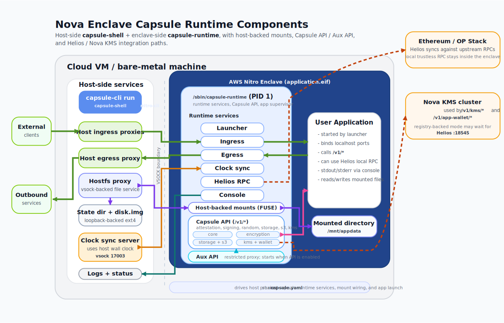

Nova Enclave Capsule is an open source toolkit that simplifies packaging and running applications inside [AWS Nitro Enclaves](https://aws.amazon.com/ec2/nitro/nitro-enclaves/). It handles the complexity of enclave networking (ingress/egress proxies), cryptographic attestation, secure key management (KMS integration), host-backed directory mounts, and application lifecycle management, so you can focus on building your application.

Nova Enclave Capsule began as a fork of [enclaver-io/enclaver](https://github.com/enclaver-io/enclaver) and now lives as an independent repository with a substantially expanded runtime, build pipeline, and enclave service surface, including the Capsule API, Ethereum signing, P-384 ECDH encryption, S3-backed storage, trustless Helios RPC, host-backed directory mounts, and KMS-backed key management.

## Nova Enclave Capsule Highlights

- **Secure Capsule API**: Gives enclave apps built-in APIs for attestation, randomness, signing, encryption, and storage operations, so application code can call localhost HTTP endpoints instead of integrating the AWS NSM SDK directly. See [Capsule API Reference](docs/capsule-api.md) and [Capsule API Mock](docs/capsule-api-mock.md).
- **Ingress and egress control**: Routes inbound traffic into the enclave and outbound HTTP/HTTPS traffic through explicit proxy and policy layers. See [Nova Enclave Capsule CLI Reference](docs/capsule-cli.md), [Port Handling](docs/port_handling.md), and [HTTP(S) Proxy Support Guidance](docs/http_proxy_support_guidance_for_enclave_applications.md).
- **Host-backed storage**: Exposes host-backed directory mounts inside the enclave as normal filesystem paths for application code. See [Host-Backed Directory Mounts Guide](docs/host_backed_mounts.md).
- **Runtime supervision**: Starts the app, streams logs, reports exit status, and keeps the enclave wall clock synchronized with the host. See [Capsule Runtime User Guide](docs/capsule-runtime.md), [Capsule Runtime Implementation Details](docs/capsule-runtime-details.md), and [Clock Drift & Time Sync](docs/nitro_enclave_clock_drift.md).
- **Ethereum signing**: Adds secp256k1-based signing flows for enclave applications and Capsule API clients. See [Capsule API Reference](docs/capsule-api.md).
- **Trustless Helios RPC**: Runs Helios light-client RPC inside the enclave for Ethereum and OP Stack workloads. See [Helios RPC Integration](docs/helios_rpc.md).
- **S3-backed storage**: Supports encrypted object storage flows for enclave applications. See [Capsule API Reference](docs/capsule-api.md).
- **KMS-backed key management**: Integrates external KMS-backed signing and derivation flows into the enclave runtime. See [Capsule API Reference](docs/capsule-api.md).

## Nova Enclave Capsule Runtime Architecture

The diagram below shows the runtime component relationships across the host container, the enclave, Capsule Runtime, and the main integrations.

For architecture details, see [Runtime Architecture](docs/architecture.md) and [Detailed Architecture](docs/capsule-architecture.md).



## Installation

Run this command to install the latest version of the `capsule-cli` CLI tool:

```bash
/bin/bash -c "$(curl -fsSL https://raw.githubusercontent.com/sparsity-xyz/nova-enclave-capsule/refs/heads/main/install.sh)"
```

Current automated release artifacts and the installer script target Linux `x86_64` only.

## Quick Start

See [examples/hn-fetcher/readme.md](examples/hn-fetcher/readme.md) for a quick start example of building and running an enclave application with Nova Enclave Capsule.

For runtime configuration and feature-specific guides, use the links in the documentation section below.

## Important: HTTP(S) Proxy Support for Enclave Apps

Applications running **inside the enclave** have no direct outbound network access. Any external HTTP/HTTPS traffic must go through Nova Enclave Capsule/Capsule Runtime's egress proxy.

- Your application (and the HTTP client library it uses) **must** support proxy routing via `HTTP_PROXY`, `HTTPS_PROXY`, and `NO_PROXY` (or be explicitly configured to use a proxy).
- If the client library ignores these environment variables, the app may work outside the enclave but **fail inside** unless you configure the proxy explicitly. The repo's `examples/hn-fetcher/app.js` shows one explicit-proxy pattern.

See [docs/http_proxy_support_guidance_for_enclave_applications.md](docs/http_proxy_support_guidance_for_enclave_applications.md) for the runtime contract, verification checklist, and common pitfalls.

## Documentation

Core feature docs are linked from [Nova Enclave Capsule Highlights](#nova-enclave-capsule-highlights). Additional references:

- [capsule.yaml Reference](docs/capsule.yaml) — Complete manifest configuration with parameter usage annotations
- [Base Images](docs/base-images.md) — What the capsule-runtime / capsule-shell base images contain and how to inspect them
- [Building Images](docs/building_images_guidance.md) — Local build flow for capsule-runtime, capsule-shell, and nitro-cli images
- [VSOCK Runtime Model](docs/vsock_runtime.md) — How CID-derived VSOCK ports work, including multiple Nova Enclave Capsule instances on one EC2
- [Nitro CLI FUSE Image](docs/nitro_cli_fuse_image.md) — Why and how the Nitro CLI image rebuilds enclave blobs with FUSE enabled
- [CI and Release Workflows](docs/ci.md) — How repository CI and release pipelines are structured


## Container and EIF Layout

The ASCII view below keeps the original file/layout-oriented perspective: what the release image contains, how `capsule-shell` launches the EIF, and what is embedded inside the enclave image.

```text
┌──────────────────────────────────────────────────────────────────────────────┐
│ Docker Image (release) - runs as a single container                          │
│                                                                              │
│  entrypoint: /usr/local/bin/capsule-shell                                     │
│  includes:                                                                   │
│    - /bin/nitro-cli                                                          │
│    - /enclave/capsule.yaml   (host-side runtime manifest copy)              │
│    - /enclave/application.eif                                                │
│                                                                              │
│  Runtime bind mounts (when `--mount` is used):                               │
│    - /mnt/capsule-hostfs-data/<name>  (host-backed loopback mount)          │
│                                                                              │
│  Image layers (top -> bottom):                                               │
│    [L3] /enclave/application.eif                                             │
│    [L2] /enclave/capsule.yaml                                               │
│    [L1] Capsule Shell image (contains capsule-shell, nitro-cli)                      │
│                                                                              │
│  Runtime control flow:                                                       │
│    capsule-shell --> nitro-cli run-enclave --eif /enclave/application.eif     │
│                  \-> reads /enclave/capsule.yaml for host-side runtime      │
└──────────────────────────────────────────────────────────────────────────────┘

                     | launches enclave with EIF
                     v
┌─────────────────────────── Enclave (application.eif) ────────────────────────┐
│ /etc/capsule/capsule.yaml (matching manifest copy embedded for capsule-runtime)       │
│                                                                              │
│ /sbin/capsule-runtime (supervisor)                                                      │
│   Runtime services                                                           │
│   - launcher:   start and monitor the application                            │
│   - ingress:    inbound traffic --> app                                      │
│   - egress:     app --> outbound traffic                                     │
│   - hostfs:     mount `/mnt/...` dirs via hostfs proxy                       │
│   - clock-sync: keep enclave wall clock aligned with host time               │
│   - helios:     trustless Ethereum / OP Stack light client RPC               │
│   - console:    collect app stdout/stderr --> container logs                 │
│                                                                              │
│   Capsule API (`/v1/*`)                                                     │
│   - core:       attestation, signing, random                                 │
│   - encryption: `/v1/encryption/*` (P-384 ECDH)                              │
│   - storage:    `/v1/s3/*` persistent storage integration                    │
│   - kms:        `/v1/kms/*` + `/v1/app-wallet/*` backed by Nova KMS          │
│                                                                              │
│ [User Application] (started and supervised by capsule-runtime; sees `/mnt/...`)         │
└──────────────────────────────────────────────────────────────────────────────┘
```

Data paths overview:

- External clients -> container networking -> `capsule-runtime.ingress` -> app
- App -> `capsule-runtime.egress` -> container networking -> external services
- App file I/O under `/mnt/...` -> `capsule-runtime.hostfs` -> hostfs proxy -> host-backed loopback image
- `capsule-runtime.clock-sync` <-> host vsock time server <-> host wall clock
- `capsule-runtime` Capsule API (`/v1/kms/*`) <-> Nova KMS cluster via registry discovery
- App stdout/stderr -> `capsule-runtime.console` -> Docker container logs
