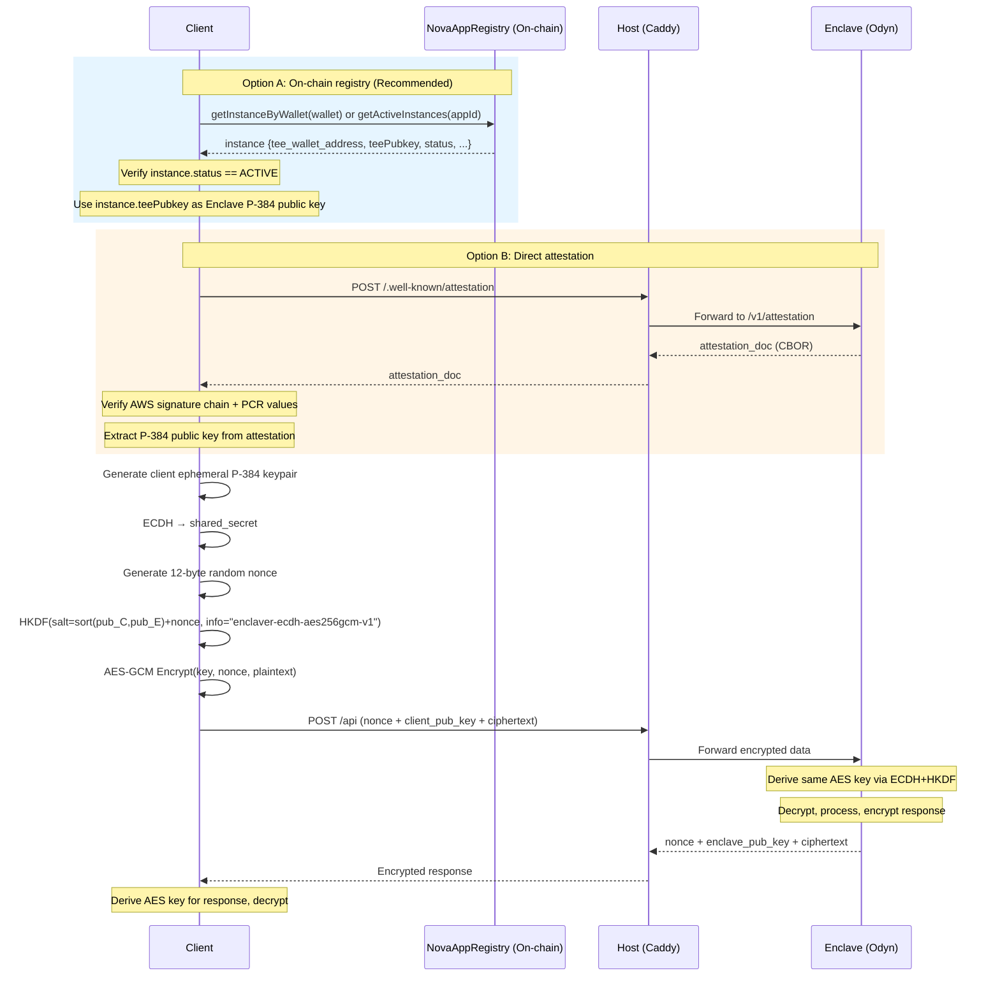
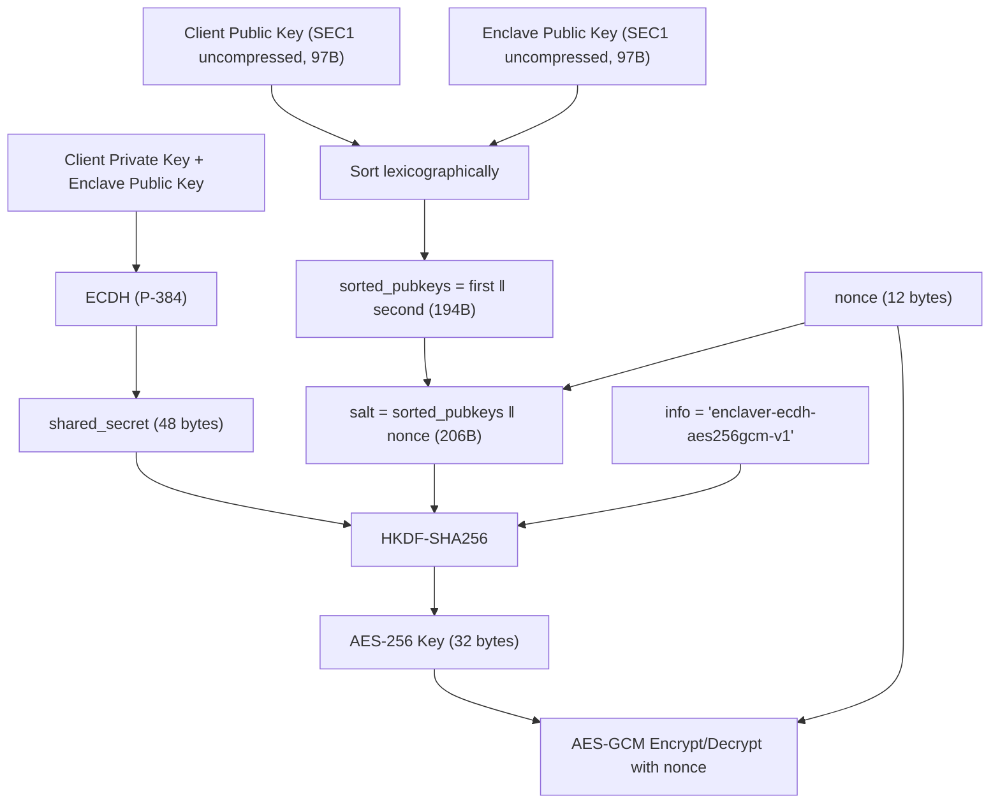

# Nova Platform Data Encryption Guide

This document describes the communication architecture between users and Enclave applications in the Nova Platform, security risks, and the recommended end-to-end encryption approach.

## 1. Communication Architecture Overview

### 1.1 Complete Communication Flow

```
User (Browser/Client)
        │
        │ HTTPS
        ▼
┌─────────────────────────────────────────────────────────────┐
│                    EC2 Instance (Host)                       │
│  ┌─────────────────────────────────────────────────────────┐│
│  │              Caddy Reverse Proxy                         ││
│  │  - Automatic HTTPS (Let's Encrypt)                       ││
│  │  - Routes /.well-known/attestation → attestation port    ││
│  │  - Routes other requests → app port                      ││
│  └─────────────────────────────────────────────────────────┘│
│                           │                                  │
│                      VSOCK (Plaintext)                       │
│                           │                                  │
│  ┌─────────────────────────────────────────────────────────┐│
│  │              Nitro Enclave (Trusted Zone)                ││
│  │  - Isolated memory & CPU                                 ││
│  │  - No local persistent storage; optional S3 via Internal API ││
│  │  - Communicates with Host only via VSOCK                 ││
│  │  - Odyn Supervisor + Your Application                    ││
│  └─────────────────────────────────────────────────────────┘│
└─────────────────────────────────────────────────────────────┘
```

### 1.2 Caddy Reverse Proxy Configuration

In the Nova Platform's app-node, each deployed application automatically gets a Caddy reverse proxy configuration:

```caddy
# App {app_id} - Auto-generated by app-node agent
{domains} {
    # Route attestation requests to attestation port
    handle /.well-known/attestation* {
        rewrite * /v1/attestation
        reverse_proxy localhost:{attestation_port}
    }
    
    # Route other requests to app port
    handle {
        reverse_proxy localhost:{app_port}
    }
    
    # Automatic HTTPS with Let's Encrypt
}
```

**Caddy's Responsibilities:**
- **HTTPS Certificate Management**: Automatically obtains and renews Let's Encrypt certificates
- **Request Routing**: Distributes attestation and application requests to correct ports
- **Reverse Proxy**: Converts external HTTPS requests to internal HTTP requests

## 2. Security Risk Analysis

### 2.1 Nitro Enclave Threat Model

AWS Nitro Enclaves assume that **the Host is untrusted**. Even if an attacker fully controls the Host OS, they cannot:
- Read Enclave memory
- Interfere with computations inside the Enclave

However, if an attacker controls the Host, they can:

| Attack Vector | Risk Description |
|---------------|------------------|
| **Eavesdrop on VSOCK** | Plaintext VSOCK communication can be intercepted by malware on the Host |
| **Tamper with Requests/Responses** | Attacker can modify data entering or leaving the Enclave |
| **Man-in-the-Middle Attack** | Attacker can impersonate the Enclave when communicating with users |

### 2.2 Current Architecture Security Boundaries

```
User ──────HTTPS────── Caddy ──────Plaintext────── Enclave
      ↑                      ↑
      │                      │
   HTTPS Edge Protected   NOT Protected!
   (to Host only)       (Host ↔ Enclave)
```

**Critical Issue: Host-edge HTTPS only protects traffic to the Host, not to the Enclave!**

- Caddy runs on the Host, HTTPS terminates at Caddy
- The VSOCK channel between Host and Enclave is plaintext
- If the Host is compromised, attackers can fully eavesdrop and tamper with communication

### 2.3 Why End-to-End Encryption is Needed

Standard edge HTTPS cannot solve these problems:

1. **Cannot verify Enclave identity**: Users cannot confirm their requests are processed by a trusted Enclave
2. **Host can eavesdrop**: HTTPS terminates at Host, plaintext is exposed in Host memory
3. **Cannot prevent Host tampering**: A malicious Host can modify requests or responses

## 3. Recommended End-to-End Encryption Approach

### 3.1 Approach Overview

Use **P-384 ECDH + HKDF-SHA256 + AES-256-GCM** to achieve true end-to-end encryption. The Enclave's P-384 public key (`teePubkey`) can be obtained through two methods:

| Method | Source | Trust Basis | Recommended For |
|--------|--------|-------------|-----------------|
| **On-chain registry (Recommended)** | `NovaAppRegistry.getInstanceByWallet()` | On-chain attestation verification + ZK proof | Enclave-to-enclave, backend clients |
| **Direct attestation** | `/.well-known/attestation` endpoint | Client-side AWS signature verification | Browser clients, audit tools |

> **Recommended**: Query the `NovaAppRegistry` smart contract to retrieve the instance's `teePubkey` and `tee_wallet_address`. This is the preferred approach because the registry only stores keys from instances that have passed on-chain attestation verification (and optionally ZK verification). This eliminates the need for the client to implement complex attestation parsing.



### 3.2 Encryption Specifications

| Component | Specification |
|-----------|---------------|
| **Key Agreement** | P-384 ECDH (secp384r1) |
| **Key Derivation** | HKDF-SHA256 |
| **HKDF Salt** | `sorted(pubkey_A_sec1, pubkey_B_sec1) ‖ nonce` |
| **HKDF Info** | `"enclaver-ecdh-aes256gcm-v1"` |
| **Symmetric Encryption** | AES-256-GCM |
| **Nonce** | Exactly 12 random bytes (no legacy 32-byte) |
| **Nonce Replay Protection** | Server-side LRU cache rejects duplicate (pubkey, nonce) pairs |
| **Response Signature** | EIP-191 signature (Enclave ETH key) |

> **IMPORTANT**: The HKDF salt includes both public keys (sorted lexicographically as uncompressed SEC1 bytes) and the nonce. This ensures each message derives a unique AES key, even between the same key pair. Clients MUST implement this exact key derivation to interoperate with the Enclave.

### 3.3 Key Derivation Protocol

The following diagram shows the exact key derivation steps that **both** the client and enclave must follow to produce the same AES-256 key:



**Critical details:**
- Public keys MUST be in **uncompressed SEC1** format (97 bytes: `0x04` prefix + 96 bytes), NOT DER/SPKI
- Public keys are sorted as raw byte arrays using **lexicographic comparison**
- The nonce MUST be exactly 12 bytes — 32-byte legacy nonces are no longer accepted
- The HKDF info string is `b"enclaver-ecdh-aes256gcm-v1"` (ASCII bytes, no null terminator)

### 3.4 Detailed Encryption Flow

#### Step 1: Obtain Enclave's P-384 Public Key (teePubkey)

**Option A (Recommended): Query NovaAppRegistry on-chain**

```typescript
// Query on-chain registry for the target instance
const instance = await novaAppRegistry.getInstanceByWallet(instanceWallet);

// Verify instance is active
assert(instance.status === InstanceStatus.ACTIVE);

// teePubkey is the Enclave's P-384 public key (DER-encoded, hex)
const enclavePublicKeyDer = hexToBytes(instance.teePubkey);

// The registry guarantees this key was included in a verified attestation
// during registerInstance(), so no additional attestation verification needed.
```

**Option B: Direct attestation verification**

```typescript
// Request attestation document directly from the Enclave
const response = await fetch(`${enclaveUrl}/.well-known/attestation`, {
    method: 'POST',
    body: JSON.stringify({ nonce: '', public_key: '' })
});
const attestationDoc = await response.arrayBuffer();

// 1. Parse CBOR attestation document
// 2. Verify AWS Nitro signature chain (root → intermediate → attestation)
// 3. Verify PCR values match expected (code integrity)
// 4. Extract P-384 public key from the verified attestation
const enclavePublicKeyDer = extractPublicKeyFromAttestation(attestationDoc);
```

#### Step 3: Encrypt a Request (Per-Message Key Derivation)

Each message requires a fresh nonce and a fresh AES key derivation:

```typescript
import { p384 } from '@noble/curves/p384';
import { hkdf } from '@noble/hashes/hkdf';
import { sha256 } from '@noble/hashes/sha256';

// --- One-time setup ---

// Generate client ephemeral keypair
const clientPrivateKey = p384.utils.randomPrivateKey();
const clientPublicKeyUncompressed = p384.getPublicKey(clientPrivateKey, false); // 97 bytes

// Parse enclave public key from DER to uncompressed SEC1
const enclavePublicKeyUncompressed = parseDerToSec1Uncompressed(enclavePublicKeyDer);

// Compute ECDH shared secret (one-time per keypair)
const sharedSecret = p384.getSharedSecret(clientPrivateKey, enclavePublicKeyUncompressed);

// --- Per-message encryption ---

function encryptMessage(plaintext: string): { nonce: string; client_public_key: string; encrypted_data: string } {
    // 1. Generate fresh 12-byte nonce
    const nonce = crypto.getRandomValues(new Uint8Array(12));

    // 2. Sort public keys lexicographically
    const [first, second] = compareBytes(clientPublicKeyUncompressed, enclavePublicKeyUncompressed) <= 0
        ? [clientPublicKeyUncompressed, enclavePublicKeyUncompressed]
        : [enclavePublicKeyUncompressed, clientPublicKeyUncompressed];

    // 3. Build HKDF salt: sorted_pubkeys + nonce
    const salt = new Uint8Array([...first, ...second, ...nonce]);

    // 4. Derive AES-256 key via HKDF-SHA256
    const aesKey = hkdf(sha256, sharedSecret, salt, 'enclaver-ecdh-aes256gcm-v1', 32);

    // 5. AES-GCM encrypt
    const ciphertext = aesGcmEncrypt(aesKey, nonce, new TextEncoder().encode(plaintext));

    return {
        nonce: bufferToHex(nonce),
        client_public_key: bufferToHex(clientPublicKeyDer),  // Send DER format
        encrypted_data: bufferToHex(ciphertext),
    };
}
```

#### Step 4: Send Encrypted Request

```typescript
const encrypted = encryptMessage(JSON.stringify({ message: 'Hello, Enclave!' }));

await fetch(`${enclaveUrl}/api`, {
    method: 'POST',
    headers: { 'Content-Type': 'application/json' },
    body: JSON.stringify({
        nonce: encrypted.nonce,
        public_key: encrypted.client_public_key,
        data: encrypted.encrypted_data,
    })
});
```

#### Step 5: Enclave Decrypts and Responds

```python
# Enclave uses Odyn API to decrypt — HKDF is handled internally by Odyn
from odyn import Odyn

odyn = Odyn()

# Decrypt client request (Odyn handles ECDH + HKDF + AES-GCM internally)
plaintext = odyn.decrypt_data(
    nonce_hex=request.nonce,
    client_public_key_hex=request.public_key,
    encrypted_data_hex=request.data
)

# Process request...
response_data = process_request(plaintext)

# Encrypt response (Odyn generates nonce and derives key internally)
encrypted_response, enclave_pub_key, response_nonce = odyn.encrypt_data(
    data=json.dumps(response_data),
    client_public_key_der=bytes.fromhex(request.public_key)
)

# Sign response (EIP-191)
signature = odyn.sign_message(response_data)
```

#### Step 6: Client Decrypts Response

```typescript
function decryptResponse(
    responseNonce: string,
    enclavePubKeyDer: string,
    encryptedData: string
): string {
    const nonce = hexToBytes(responseNonce);
    // Derive AES key using the SAME protocol (sorted pubkeys + nonce)
    const [first, second] = compareBytes(clientPublicKeyUncompressed, enclavePublicKeyUncompressed) <= 0
        ? [clientPublicKeyUncompressed, enclavePublicKeyUncompressed]
        : [enclavePublicKeyUncompressed, clientPublicKeyUncompressed];
    const salt = new Uint8Array([...first, ...second, ...nonce]);
    const aesKey = hkdf(sha256, sharedSecret, salt, 'enclaver-ecdh-aes256gcm-v1', 32);
    
    const plaintext = aesGcmDecrypt(aesKey, nonce, hexToBytes(encryptedData));
    return new TextDecoder().decode(plaintext);
}
```

## 4. Reference Implementation

### 4.1 Complete Example Project

**secured-chat-bot**: An end-to-end encrypted AI chat application

- Repository: [sparsity-nova-examples/secured-chat-bot](https://github.com/sparsity-xyz/sparsity-nova-examples/tree/main/secured-chat-bot)

Project structure:
```
secured-chat-bot/
├── enclave/           # TEE backend
│   ├── app.py         # Flask API + encryption handling
│   └── odyn.py        # Odyn API wrapper (with encryption methods)
└── frontend/          # Next.js frontend
    └── src/lib/
        ├── crypto.ts      # ECDH + AES-GCM encryption
        └── attestation.ts # Attestation verification
```

### 4.2 Odyn Python Wrapper (Backend)

`odyn.py` provides a simple encryption API:

```python
from odyn import Odyn

odyn = Odyn()

# Get Enclave public key
pub_data = odyn.get_encryption_public_key_data()
# Returns: {'public_key_der': '0x...', 'public_key_pem': '-----BEGIN PUBLIC KEY-----...'}

# Decrypt client data (HKDF key derivation handled internally by Odyn)
plaintext = odyn.decrypt_data(
    nonce_hex="...",
    client_public_key_hex="0x...",
    encrypted_data_hex="0x..."
)

# Encrypt response data (Odyn generates nonce and derives key internally)
encrypted_data, enclave_pub_key, nonce = odyn.encrypt_data(
    data="response string",
    client_public_key_der=client_pub_key_bytes
)

# Sign data (EIP-191)
signature = odyn.sign_message({"key": "value"})
```

### 4.3 Frontend Encryption Client (TypeScript)

The `EnclaveClient` class in `crypto.ts` wraps the complete flow:

```typescript
import { EnclaveClient } from './crypto';

const client = new EnclaveClient();

// Connect to Enclave (get attestation + establish keys)
const attestation = await client.connect('https://your-app.example.com');

// Encrypt request (derives fresh AES key per message via HKDF)
const encrypted = await client.encrypt(JSON.stringify({ message: 'Hello' }));

// Send encrypted request
const response = await fetch('/api', {
    method: 'POST',
    body: JSON.stringify(encrypted)
});

// Decrypt response (derives matching AES key via HKDF)
const decrypted = await client.decrypt(await response.json());
```

### 4.4 Odyn Internal API Reference

The Odyn Supervisor runs at `localhost:18000` inside the Enclave and provides the following encryption-related APIs. Your application can call these APIs via HTTP to implement end-to-end encryption.

#### 5.4.1 Get Encryption Public Key

Retrieve the Enclave's P-384 public key for ECDH key agreement.

- **URL:** `/v1/encryption/public_key`
- **Method:** `GET`
- **Response:**
  ```json
  {
    "public_key_der": "0x3076...",
    "public_key_pem": "-----BEGIN PUBLIC KEY-----\n...\n-----END PUBLIC KEY-----"
  }
  ```

| Field | Description |
|-------|-------------|
| `public_key_der` | Hex-encoded DER format public key (SPKI), suitable for encryption operations |
| `public_key_pem` | PEM format public key, suitable for standard crypto libraries |

#### 5.4.2 Decrypt Client Data

Decrypt data sent from a client using ECDH + AES-256-GCM.

- **URL:** `/v1/encryption/decrypt`
- **Method:** `POST`
- **Content-Type:** `application/json`
- **Request Body:**
  ```json
  {
    "nonce": "0x...",              // Hex-encoded nonce (exactly 12 bytes)
    "client_public_key": "0x...",  // Hex-encoded client DER public key
    "encrypted_data": "0x..."      // Hex-encoded ciphertext (with auth tag)
  }
  ```
- **Response:**
  ```json
  {
    "plaintext": "decrypted string"
  }
  ```

**How it works:**
1. Odyn uses the Enclave private key and client public key to perform ECDH and compute shared secret
2. Both public keys are converted to uncompressed SEC1 format and sorted lexicographically
3. HKDF-SHA256 derives the AES-256 key using `salt = sorted_pubkeys ‖ nonce` and `info = "enclaver-ecdh-aes256gcm-v1"`
4. AES-256-GCM decrypts the data using the derived key and the nonce
5. Duplicate (client_public_key, nonce) pairs are rejected to prevent replay attacks

#### 5.4.3 Encrypt Response Data

Encrypt data to send to a client.

- **URL:** `/v1/encryption/encrypt`
- **Method:** `POST`
- **Content-Type:** `application/json`
- **Request Body:**
  ```json
  {
    "plaintext": "string to encrypt",
    "client_public_key": "0x..."   // Hex-encoded client DER public key
  }
  ```
- **Response:**
  ```json
  {
    "encrypted_data": "...",       // Hex-encoded ciphertext
    "enclave_public_key": "...",   // Hex-encoded Enclave public key
    "nonce": "..."                 // Hex-encoded nonce (12 bytes)
  }
  ```

#### 5.4.4 Generate Attestation Document

Generate an attestation document from the Nitro Secure Module (NSM).

- **URL:** `/v1/attestation`
- **Method:** `POST`
- **Content-Type:** `application/json`
- **Request Body:**
  ```json
  {
    "nonce": "base64_encoded_nonce",        // Optional
    "public_key": "PEM_encoded_public_key", // Optional, usually the encryption public key
    "user_data": "base64_encoded_user_data" // Optional
  }
  ```
- **Response:** 
  - **Content-Type:** `application/cbor`
  - **Body:** Binary CBOR data (Attestation Document)

**Attestation Document contains:**
- PCR values (code integrity hashes)
- Your provided public_key (if any)
- AWS Nitro signature chain

#### 5.4.5 Sign Message (EIP-191)

Sign a message using the Enclave's Ethereum private key.

- **URL:** `/v1/eth/sign`
- **Method:** `POST`
- **Content-Type:** `application/json`
- **Request Body:**
  ```json
  {
    "message": "hello world",       // Plaintext to sign (non-empty)
    "include_attestation": false    // Whether to include attestation
  }
  ```
- **Response:**
  ```json
  {
    "signature": "0x...",
    "address": "0x...",
    "attestation": null
  }
  ```

**Signature format:** EIP-191 personal_sign, automatically adds `"\u0019Ethereum Signed Message:\n<len>"` prefix.

#### 5.4.6 Get Ethereum Address

Retrieve the Enclave's Ethereum address and public key.

- **URL:** `/v1/eth/address`
- **Method:** `GET`
- **Response:**
  ```json
  {
    "address": "0x742d35Cc6634C0532925a3b844Bc9e7595f0bEb",
    "public_key": "0x04..."
  }
  ```

#### 5.4.7 Get Random Bytes

Obtain cryptographically secure random bytes from the Nitro Secure Module.

- **URL:** `/v1/random`
- **Method:** `GET`
- **Response:**
  ```json
  {
    "random_bytes": "0x..."  // 32 bytes hex-encoded
  }
  ```

#### 5.4.8 API Usage Example (Python)

Complete encryption handling flow:

```python
import requests
import json

ODYN_API = "http://localhost:18000"

class EnclaveEncryption:
    def decrypt_request(self, encrypted_payload):
        """Decrypt a request from the client.
        
        Odyn internally performs:
        1. ECDH with client public key
        2. HKDF-SHA256 with salt=sort(pubkeys)+nonce, info="enclaver-ecdh-aes256gcm-v1"
        3. AES-256-GCM decrypt
        """
        response = requests.post(
            f"{ODYN_API}/v1/encryption/decrypt",
            json={
                "nonce": encrypted_payload["nonce"],
                "client_public_key": encrypted_payload["public_key"],
                "encrypted_data": encrypted_payload["data"]
            }
        )
        response.raise_for_status()
        return response.json()["plaintext"]
    
    def encrypt_response(self, plaintext, client_public_key):
        """Encrypt a response to send to the client.
        
        Odyn internally generates a fresh nonce and derives the AES key
        using the same HKDF protocol.
        """
        response = requests.post(
            f"{ODYN_API}/v1/encryption/encrypt",
            json={
                "plaintext": plaintext,
                "client_public_key": client_public_key
            }
        )
        response.raise_for_status()
        return response.json()
    
    def sign_response(self, data):
        """Sign response data"""
        message = json.dumps(data, sort_keys=True, separators=(',', ':'))
        response = requests.post(
            f"{ODYN_API}/v1/eth/sign",
            json={"message": message, "include_attestation": False}
        )
        response.raise_for_status()
        return response.json()["signature"]

# Usage in a Flask application
encryption = EnclaveEncryption()

@app.route('/api/secure', methods=['POST'])
def secure_endpoint():
    encrypted_request = request.json
    
    # 1. Decrypt request
    plaintext = encryption.decrypt_request(encrypted_request)
    data = json.loads(plaintext)
    
    # 2. Process business logic
    result = process_data(data)
    
    # 3. Encrypt response
    encrypted_response = encryption.encrypt_response(
        json.dumps(result),
        encrypted_request["public_key"]
    )
    
    # 4. Sign response
    signature = encryption.sign_response(result)
    encrypted_response["signature"] = signature
    
    return jsonify(encrypted_response)
```

## 5. Summary and Best Practices

### 5.1 Key Points

1. **Host-edge HTTPS termination is not end-to-end encryption** - traffic is exposed before reaching enclave crypto boundaries
2. **Use Attestation to verify Enclave identity** - Ensures communication is with a trusted Enclave
3. **Use ECDH + HKDF + AES-GCM to encrypt data** - Even if Host is compromised, data remains confidential
4. **Each message derives a unique AES key** - The nonce is bound into HKDF salt, providing per-message key isolation
5. **Verify response signatures** - Ensures responses come from the same Enclave

### 5.2 Best Practices Checklist

- [ ] Implement attestation verification logic in the client
- [ ] Use P-384 (secp384r1) for ECDH key agreement
- [ ] Generate exactly 12 random bytes for each nonce — do NOT use 32-byte nonces
- [ ] Implement the correct HKDF key derivation: `salt = sorted(pubkey_A_sec1, pubkey_B_sec1) ‖ nonce`, `info = "enclaver-ecdh-aes256gcm-v1"`
- [ ] Derive a fresh AES key per message (do not cache the AES key across messages)
- [ ] Verify Enclave response signatures
- [ ] Verify PCR values in production environments

### 5.3 Related Documentation

- [Odyn Internal API](https://github.com/sparsity-xyz/enclaver/blob/sparsity/docs/internal_api.md) - Full Odyn API reference
- [Enclaver Architecture](https://github.com/sparsity-xyz/enclaver/blob/sparsity/docs/architecture.md) - Architecture overview
- [Nova Examples](https://github.com/sparsity-xyz/sparsity-nova-examples/) - More example projects
