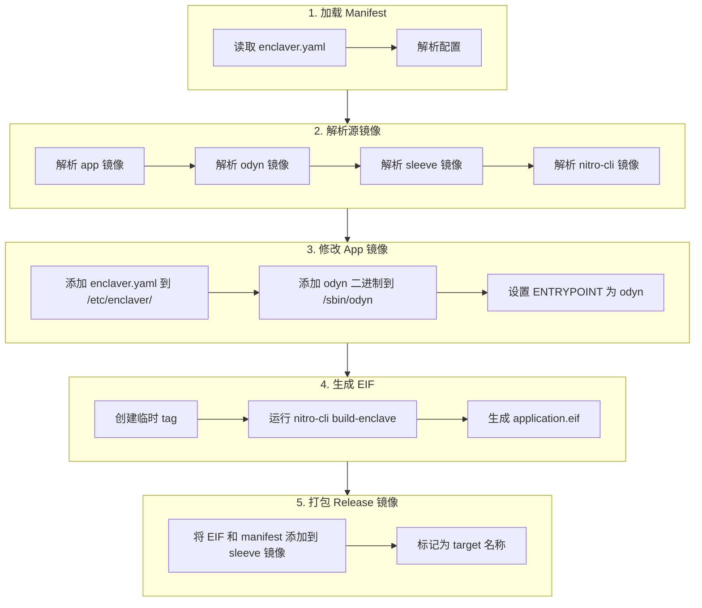
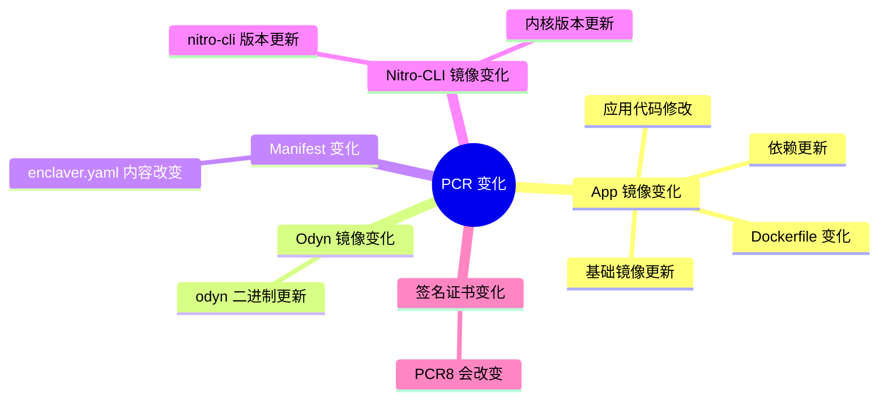
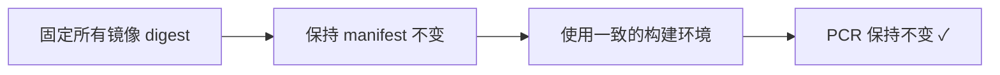

# Enclaver Build Process 详解 & PCRs 保持不变的方法

## 概述

本文档详细解释了 `enclaver build -f enclaver.yaml` 命令的执行流程，以及如何确保生成的 EIF 文件的 PCR 值保持一致。

---

## 一、`enclaver build` 执行流程

当你运行 `enclaver build -f enclaver.yaml` 时，以下是详细的执行步骤：



### 详细步骤解析

#### Step 1: 加载 Manifest
- **入口函数**: [build_release](file:///home/ubuntu/enclaver/enclaver/src/build.rs#L51-66)
- 调用 [load_manifest()](file:///home/ubuntu/enclaver/enclaver/src/manifest.rs#126-131) 读取并解析 [enclaver.yaml](file:///home/ubuntu/enclaver/examples/hn-fetcher/enclaver.yaml)
- 验证配置的完整性

#### Step 2: 解析源镜像
- **函数**: [resolve_sources](file:///home/ubuntu/enclaver/enclaver/src/build.rs#L371-408)
- 解析以下 4 个镜像：

| 镜像类型 | 来源 | 默认值 |
|---------|------|--------|
| **app** | `manifest.sources.app` | 用户指定 (必填) |
| **odyn** | `manifest.sources.odyn` | `public.ecr.aws/d4t4u8d2/sparsity-ai/odyn:latest` |
| **sleeve** | `manifest.sources.sleeve` | `public.ecr.aws/d4t4u8d2/sparsity-ai/enclaver-wrapper-base:latest` |
| **nitro-cli** | 内部硬编码 | `public.ecr.aws/s2t1d4c6/enclaver-io/nitro-cli:latest` |

#### Step 3: 修改 App 镜像 (Amend Source Image)
- **函数**: [amend_source_image](file:///home/ubuntu/enclaver/enclaver/src/build.rs#L129-215)
- 在原始 app 镜像上添加一个新 layer，包含：
  1. `/etc/enclaver/enclaver.yaml` - manifest 配置文件
  2. `/sbin/odyn` - 从 odyn 镜像复制的二进制文件
- 设置新的 ENTRYPOINT:
  ```
  /sbin/odyn --config-dir /etc/enclaver [--work-dir <working_dir>] -- <原始 ENTRYPOINT> <原始 CMD>
  ```

#### Step 4: 生成 EIF 文件
- **函数**: [image_to_eif](file:///home/ubuntu/enclaver/enclaver/src/build.rs#L254-327)
- 过程：
  1. 给修改后的镜像打一个临时 UUID tag
  2. 启动 `nitro-cli` 容器
  3. 挂载 Docker socket 和构建目录
  4. 执行 `nitro-cli build-enclave --docker-uri <tag> --output-file application.eif`
  5. 如果配置了签名，添加 `--signing-certificate` 和 `--private-key` 参数

> [!IMPORTANT]
> EIF 生成过程中会计算 PCR0, PCR1, PCR2 (以及可选的 PCR8)

#### Step 5: 打包 Release 镜像
- **函数**: [package_eif](file:///home/ubuntu/enclaver/enclaver/src/build.rs#L217-252)
- 在 sleeve 基础镜像上添加新 layer:
  - `/enclave/enclaver.yaml`
  - `/enclave/application.eif`
- 最后将镜像标记为 `manifest.target` 指定的名称

---

## 二、PCR 值的含义

AWS Nitro Enclaves 使用 Platform Configuration Registers (PCRs) 作为 enclave 的唯一身份标识：

| PCR | 测量内容 | 说明 |
|-----|---------|------|
| **PCR0** | 整个 EIF 文件的 SHA-384 哈希 | 代表完整的 enclave 镜像 |
| **PCR1** | Linux 内核 + 启动 ramdisk 的哈希 | 代表 enclave 的启动环境 |
| **PCR2** | 用户应用代码的哈希（不含 boot ramfs） | 代表实际运行的应用 |
| **PCR8** | 签名证书的哈希（如果使用签名） | 证明 EIF 的来源 |

---

## 三、影响 PCR 值的因素

### 3.1 会改变 PCR 的因素



### 3.2 详细分析

1. **App 镜像 (`sources.app`)** - 影响 PCR0, PCR2
   - 任何代码变更
   - 依赖版本变化
   - 环境变量变化
   - 文件权限/时间戳变化

2. **Odyn 镜像 (`sources.odyn`)** - 影响 PCR0, PCR2
   - odyn 二进制文件更新

3. **Manifest 文件** - 影响 PCR0, PCR2
   - [enclaver.yaml](file:///home/ubuntu/enclaver/examples/hn-fetcher/enclaver.yaml) 的任何改动（包括空格、换行）

4. **Nitro-CLI 镜像** - 影响 PCR1
   - 内部使用的 Linux 内核版本
   - 启动参数变化

---

## 四、保持 PCR 不变的方法

### 方法 1: 固定所有镜像版本 (推荐)

在 [enclaver.yaml](file:///home/ubuntu/enclaver/examples/hn-fetcher/enclaver.yaml) 中明确指定所有镜像的 **digest**，而非 tag：

```yaml
version: v1
name: "my-app"
target: "my-app-enclave:latest"
sources:
  # 使用 digest 而非 tag
  app: "my-app@sha256:abc123..."
  odyn: "public.ecr.aws/d4t4u8d2/sparsity-ai/odyn@sha256:def456..."
  sleeve: "public.ecr.aws/d4t4u8d2/sparsity-ai/enclaver-wrapper-base@sha256:ghi789..."
```

> [!TIP]
> 使用 `docker inspect <image>` 获取镜像的 digest

### 方法 2: 使用本地开发镜像

在本地构建并固定镜像：

```yaml
sources:
  app: "my-app:v1.0.0-fixed"
  odyn: "odyn-dev:latest"
  sleeve: "enclaver-wrapper-base:latest"
```

然后确保这些本地镜像不被更新。

### 方法 3: 固定 Nitro-CLI 镜像版本

**需要修改源码**。在 [build.rs](file:///home/ubuntu/enclaver/enclaver/src/build.rs#L25) 中：

```rust
// 当前代码
const NITRO_CLI_IMAGE: &str = "public.ecr.aws/s2t1d4c6/enclaver-io/nitro-cli:latest";

// 修改为固定版本
const NITRO_CLI_IMAGE: &str = "public.ecr.aws/s2t1d4c6/enclaver-io/nitro-cli@sha256:xxx...";
```

或者更好的方式是在 manifest 中支持配置 nitro-cli 镜像（需要功能扩展）。

### 方法 4: 确保构建环境一致

| 要素 | 建议 |
|------|------|
| Docker 版本 | 固定版本 |
| 构建机器 | 使用相同的 CI 环境 |
| 文件系统 | 避免时间戳影响 |
| enclaver.yaml | 使用版本控制，不做任何修改 |

### 方法 5: 使用 EIF 签名 + PCR8

如果主要目的是验证 EIF 来源，可以使用签名功能：

```yaml
signature:
  certificate: ./signing.crt
  key: ./signing.key
```

这会生成 PCR8，代表签名证书的哈希，可以用于 KMS 策略验证。

---

## 五、验证 PCR 值

构建完成后，可以查看输出中的 PCR 值：

```bash
$ enclaver build -f enclaver.yaml

# 输出示例:
{
  "Measurements": {
    "PCR0": "be7f3bfa8c460b9840f7440d4c834e42d209e1c780db9a3b63acef1a10c85cf2b6ce5d95cb34c796cf5e7f79f5fd8b5d",
    "PCR1": "4b4d5b3661b3efc12920900c80e126e4ce783c522de6c02a2a5bf7af3a2b9327b86776f188e4be1c1c404a129dbda493",
    "PCR2": "c810e8d6dbf7800b6099b13a4fa30f661c04ff2e66fddaa8b6a10df5f549b9d3275e43381aaec8dc5ff26c0148545415"
  }
}
```

也可以对现有 EIF 文件进行检查：

```bash
nitro-cli describe-eif --eif-path application.eif
```

---

## 六、完整性检查清单

在尝试保持 PCR 不变时，检查以下项目：

- [ ] App 镜像 digest 是否固定
- [ ] Odyn 镜像 digest 是否固定
- [ ] Sleeve 镜像 digest 是否固定
- [ ] enclaver.yaml 文件内容是否完全相同（包括空格换行）
- [ ] 构建环境是否一致
- [ ] nitro-cli 镜像版本是否固定（需要源码修改）

---

## 七、总结



最可靠的方式是：
1. 使用镜像 **digest** (sha256) 而非 tag
2. 将 [enclaver.yaml](file:///home/ubuntu/enclaver/examples/hn-fetcher/enclaver.yaml) 纳入版本控制
3. 在固定的 CI/CD 环境中构建
4. 如果需要，修改源码以固定 nitro-cli 镜像版本
